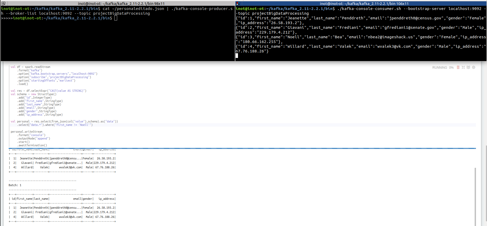

# Resultados de los ejercicios

#### 1. Iniciamos zookeeper y después el servidor de kafka.

#### 2. Creamos un topic e iniciamos un consumidor que se suscriba a dicho topic. Seguidamente podemos ejecutar un productor que envíe al topic (por ejemplo a través de un pipe) el contenido de un archivo, y este será recibido por el consumidor.

>Si el contenido se ha enviado antes de que el consumidor estuviese a la escucha, este puede igualmente recibir todo el contenido del topic si le añadimos el parámetro --from-beginning
#### 3. Probamos que zeppelin funciona correctamente con un ejercicio de ejemplo que cuenta el número de registros que tenemos en un archivo .csv

#### 4. Importamos todos los paquetes necesarios para nuestros ejercicios de streaming con kafka y ejecutamos nuestro productor.

#### 5. Ejecutamos nuestro consumidor y comprobamos que lee bien todos los registros (filtrando correctamente el nombre de Noell). Lo comprobamos también utilizando la función kafka-console-producer.sh

>Con kafka-console-consumer.sh podemos ver todo lo que está llegando y así saber que Noell se está filtrando correctamente en el consumidor que tenemos en el notebook.

>El archivo personaleditado.json que utilizamos con kafka-console-producer.sh lo sacamos de este pequeño ejercicio. Le damos un nuevo formato al json para que pueda ser procesado correctamente.

#### 6. Ejercicio que cuenta las palabras del archivo (requiere una pequeña limpieza de carácteres).

### [Cómo configurar Kafka](../tree/master/KafkaConfigure)
### [Archivos de código](../tree/master/Codigo)
### [Datos utilizados](../tree/master/datos)