# Proceso de instalación

#### 1. Necesitamos el entorno de java 8 para utilizar la versión 0.8.2 de zeppelin.
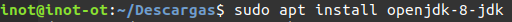
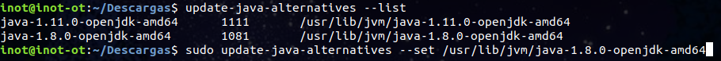
#### 2. Descargamos zeppelin de la página oficial (tenemos la opción de descargarlo con el intérprete de spark ya incluido).
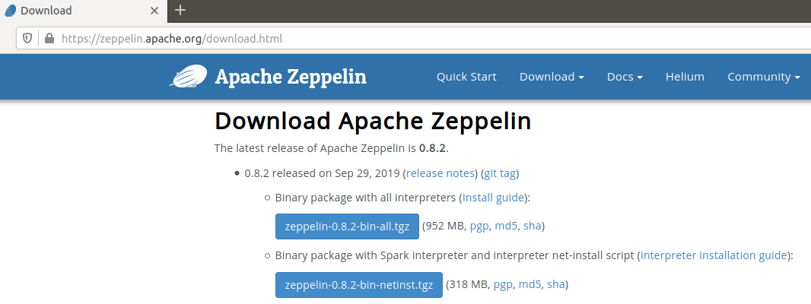
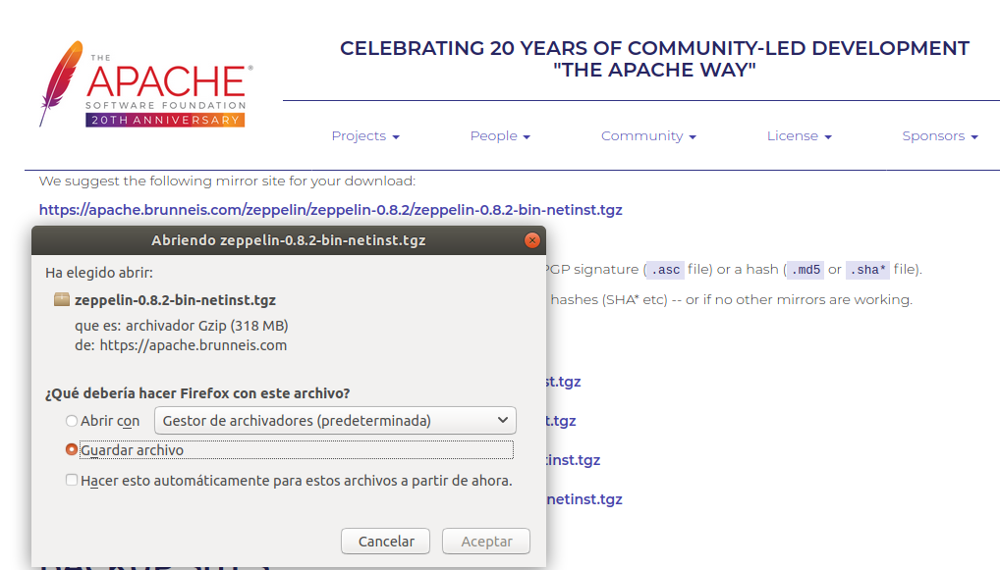
#### 3. Lo descomprimimos y accedemos a la carpeta bin.
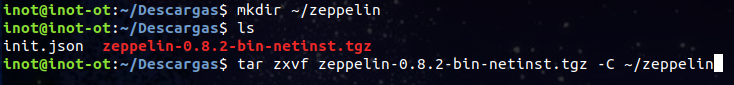
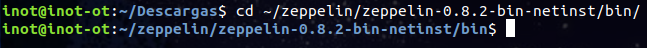
#### 4. Si no tenemos el intérprete de spark, podemos instalarlo con install-interpreter.sh
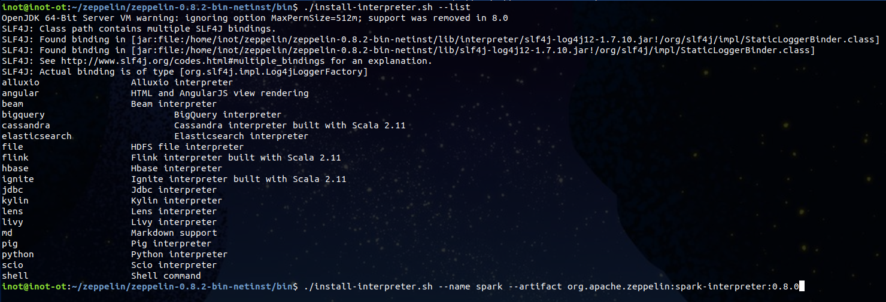
#### 5. Iniciamos el demonio de zeppelin y accedemos a localhost:8080 (puerto por defecto).
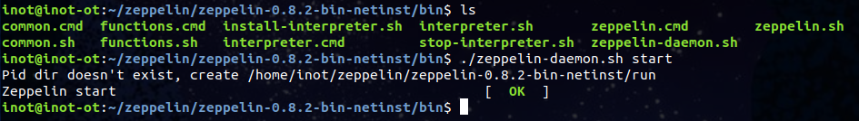
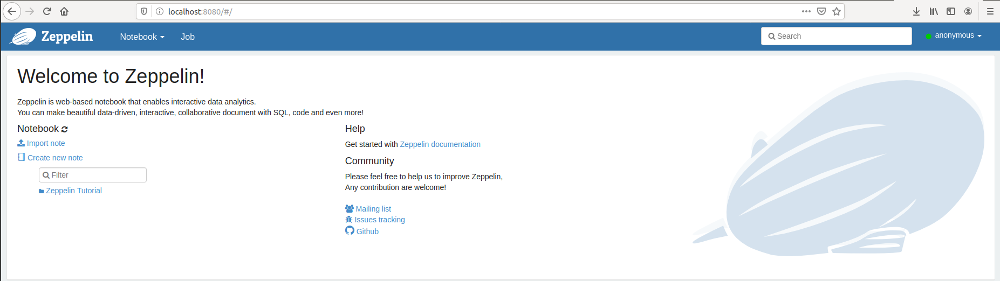
#### 6. Para configurar nuestro intérprete solo tenemos que buscarlo en el menú "Interpreter" y darle a "edit".
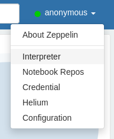
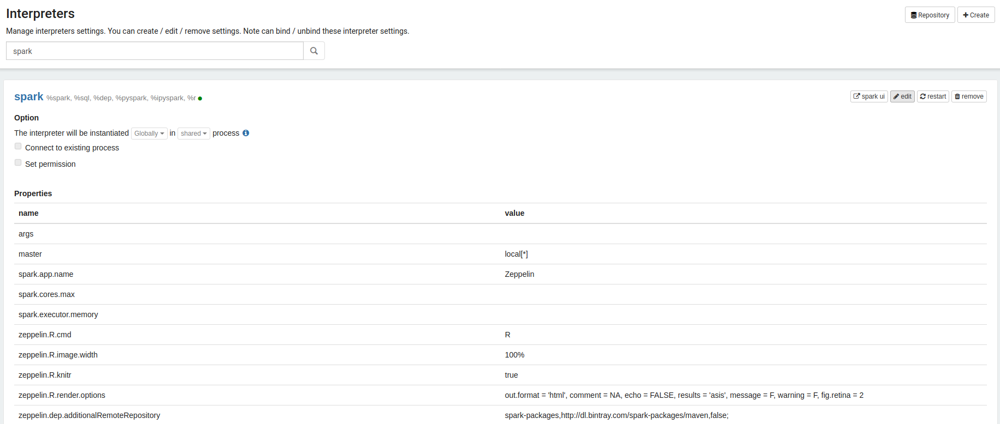
#### 7. Para crear un nuevo notebook nos vamos a "Create new note", le damos un nombre y seleccionamos el intérprete que queremos utilizar.

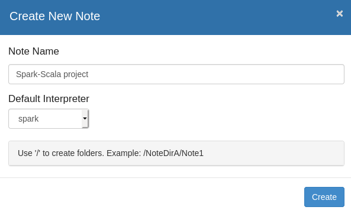
### [Cómo configurar Kafka](https://github.com/Inotist/projectSparkScala/tree/master/KafkaConfigure)
### [Resultado de los ejercicios](https://github.com/Inotist/projectSparkScala/tree/master/Ejercicios)
