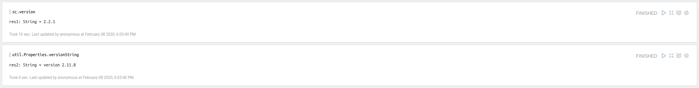
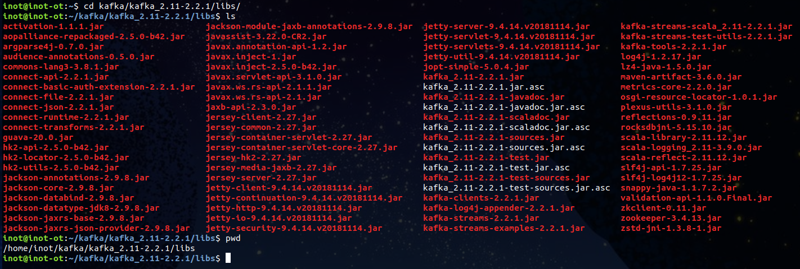
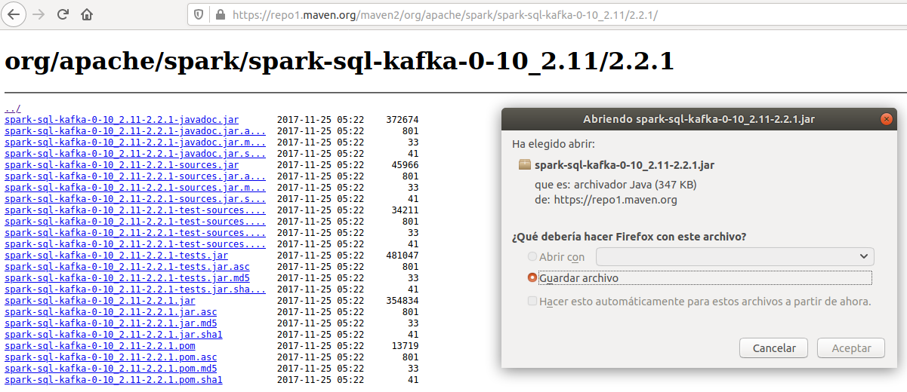
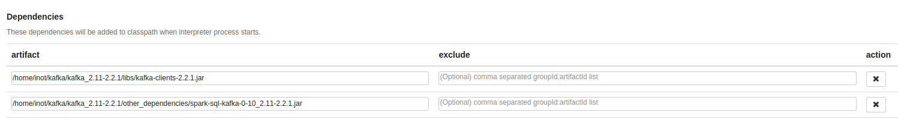

# Cómo incluir kafka en zeppelin

#### 1. Necesitamos saber qué version de spark y scala usa zeppelin para obtener las dependencias correspondientes.

#### 2. Podemos encontrar las dependencias para kafka streaming en el directorio libs de la carpeta donde tengamos instalado kafka.

#### 3. Las dependencias que no tengamos las podemos descargar del repositorio de maven.

#### 4. Luego solo tenemos que agregarlas en la configuración del intérprete, en la parte de abajo donde dice "Dependencies" y "artifact".

> En teoría deberíamos poder utilizar una ruta como "org.apache.spark:spark-sql-kafka-0-10_2.11:2.2.1", pero zeppelin se conecta al repositorio de maven por http y da un error, ya que la conexión debe realizarse obligatoriamente por https y no permite modificar esta configuración.
### [Resultado de los ejercicios](../tree/master/Ejericios)